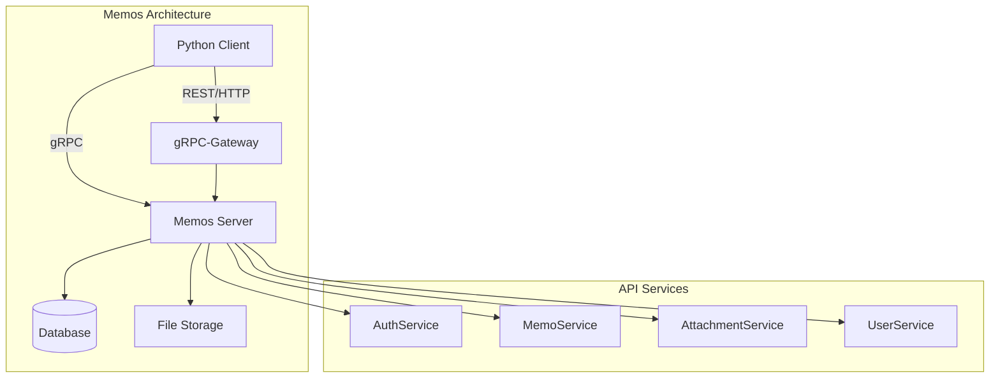
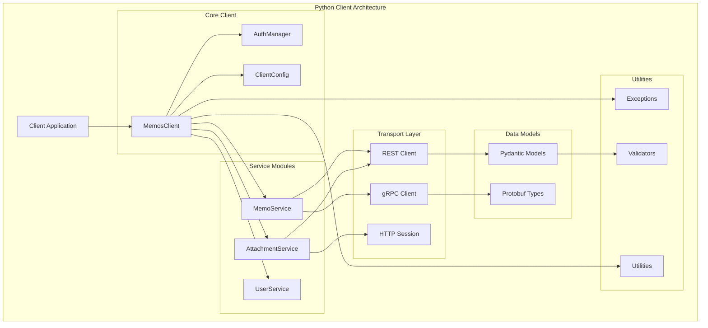
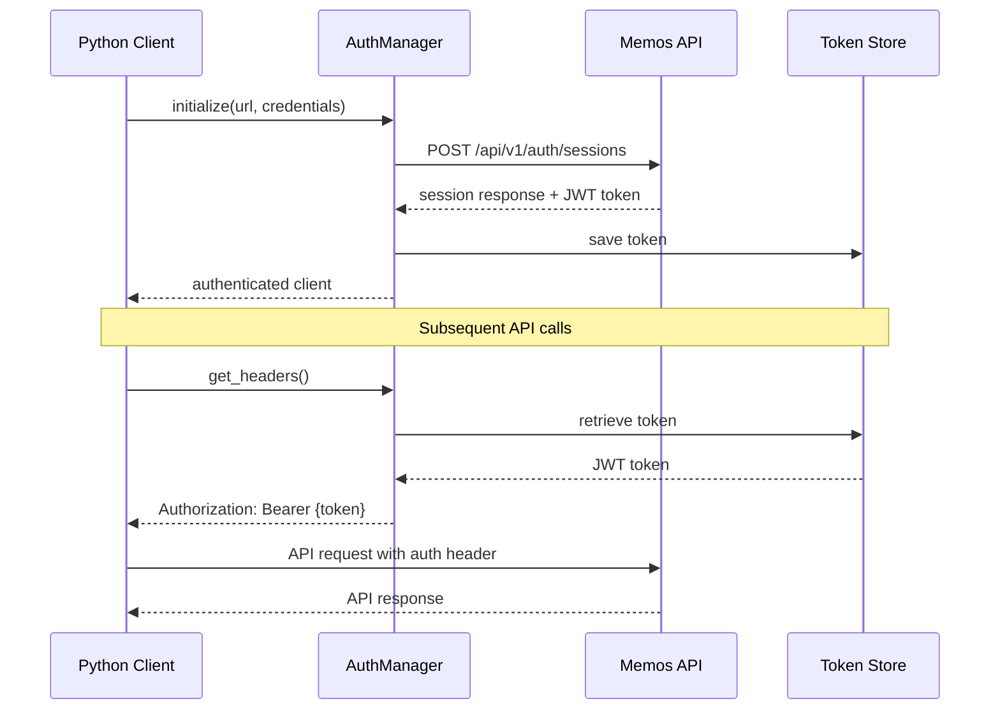
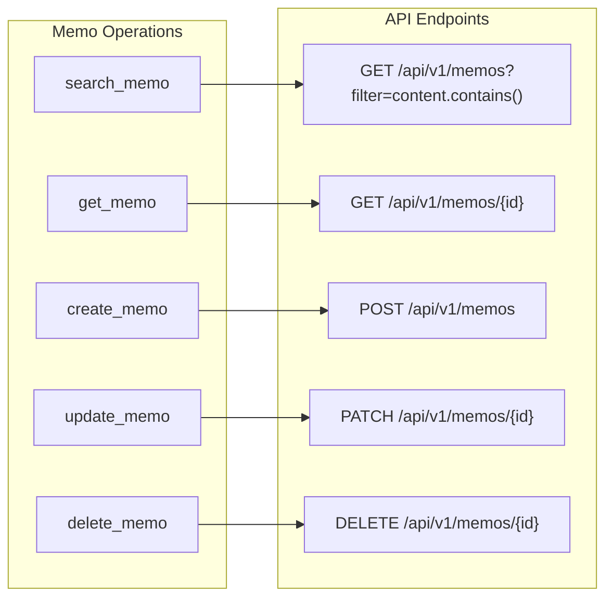
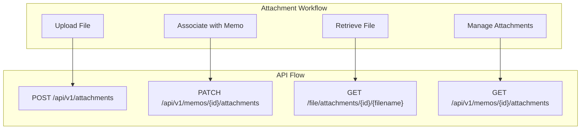

# Memos Python Client - Technical Proposal

## Executive Summary

This proposal outlines the development of a comprehensive Python client library for the Memos application. The client will provide programmatic access to memo management operations including search, retrieval, creation, updates, and attachment handling through both REST API and gRPC interfaces.

## Project Overview

### Memos Application Architecture

Memos is a modern note-taking application built with:
- **Backend**: Go with gRPC and REST APIs
- **Frontend**: React with TypeScript  
- **Database**: SQLite/MySQL/PostgreSQL support
- **API**: Dual protocol serving (gRPC + HTTP/REST)



## Python Client Architecture

### Core Design Principles

1. **Dual Protocol Support**: Support both REST and gRPC interfaces
2. **Authentication Flexibility**: JWT token and session-based authentication
3. **Resource Management**: Handle both text content and binary attachments
4. **Type Safety**: Comprehensive type hints and Pydantic models
5. **Error Handling**: Robust error handling with custom exceptions
6. **Async Support**: Async/await patterns for performance

### Client Architecture



### Authentication Flow



## Core Features Implementation

### 1. Memo Operations



### 2. Attachment Handling



### 3. Authentication Methods

The client will support multiple authentication methods:

1. **JWT Token Authentication** (Recommended)
   - Long-lived access tokens
   - Suitable for automated scripts and applications
   - Header-based: `Authorization: Bearer {token}`

2. **Session-based Authentication**
   - Username/password login
   - Cookie-based session management
   - Suitable for interactive applications

3. **SSO Authentication**
   - OAuth2 integration with external providers
   - Support for configured identity providers

## Data Models

### Core Models

```python
from typing import Optional, List, Dict, Any
from datetime import datetime
from pydantic import BaseModel, Field
from enum import Enum

class Visibility(str, Enum):
    PRIVATE = "PRIVATE"
    PROTECTED = "PROTECTED" 
    PUBLIC = "PUBLIC"

class State(str, Enum):
    NORMAL = "NORMAL"
    ARCHIVED = "ARCHIVED"

class Memo(BaseModel):
    name: str = Field(description="Resource name: memos/{memo}")
    state: State = State.NORMAL
    creator: str = Field(description="Creator resource name: users/{user}")
    create_time: datetime
    update_time: datetime
    display_time: Optional[datetime] = None
    content: str = Field(description="Markdown content")
    visibility: Visibility = Visibility.PRIVATE
    tags: List[str] = Field(default_factory=list)
    pinned: bool = False
    attachments: List['Attachment'] = Field(default_factory=list)
    snippet: str = Field(description="Plain text snippet")

class Attachment(BaseModel):
    name: str = Field(description="Resource name: attachments/{attachment}")
    create_time: datetime
    filename: str
    external_link: Optional[str] = None
    type: str = Field(description="MIME type")
    size: int = Field(description="Size in bytes")
    memo: Optional[str] = Field(description="Associated memo: memos/{memo}")

class SearchFilter(BaseModel):
    query: Optional[str] = None
    tags: Optional[List[str]] = None
    creator: Optional[str] = None
    visibility: Optional[Visibility] = None
    start_date: Optional[datetime] = None
    end_date: Optional[datetime] = None
    state: State = State.NORMAL
```

## Implementation Plan

### Phase 1: Core Infrastructure (Week 1)
- [ ] Project setup with Poetry
- [ ] Authentication manager implementation
- [ ] Base client configuration
- [ ] Error handling framework
- [ ] Basic HTTP client wrapper

### Phase 2: Memo Operations (Week 2)  
- [ ] Implement search_memo with advanced filtering
- [ ] Implement get_memo with field selection
- [ ] Implement create_memo with validation
- [ ] Implement update_memo with partial updates
- [ ] Add comprehensive unit tests

### Phase 3: Attachment Support (Week 3)
- [ ] File upload functionality
- [ ] Image processing and validation
- [ ] Attachment association with memos
- [ ] Binary data handling
- [ ] Thumbnail support

### Phase 4: Advanced Features (Week 4)
- [ ] Async client implementation
- [ ] gRPC client option
- [ ] Batch operations
- [ ] Caching layer
- [ ] Rate limiting
- [ ] Documentation and examples

### Phase 5: Testing & Polish (Week 5)
- [ ] Integration testing
- [ ] Performance optimization
- [ ] Error handling edge cases
- [ ] Documentation completion
- [ ] Example applications

## Usage Examples

### Basic Usage

```python
from memos_client import MemosClient, Visibility

# Initialize client
client = MemosClient(
    base_url="https://memos.example.com",
    access_token="your-jwt-token"
)

# Search memos
memos = await client.search_memos(
    query="python development",
    tags=["programming", "tutorial"],
    limit=10
)

# Create memo with attachment
memo = await client.create_memo(
    content="# My Python Notes\n\nSome important notes about Python...",
    visibility=Visibility.PRIVATE,
    attachments=["path/to/image.png"]
)

# Update memo
updated_memo = await client.update_memo(
    memo_id=memo.name,
    content="# Updated Python Notes\n\nUpdated content...",
    tags=["python", "advanced"]
)

# Get specific memo
memo = await client.get_memo("memos/123")
```

### Advanced Filtering

```python
from datetime import datetime, timedelta

# Complex search with multiple filters
results = await client.search_memos(
    filter={
        "content.contains": "machine learning",
        "visibility": Visibility.PUBLIC,
        "create_time.after": datetime.now() - timedelta(days=30),
        "tags.any": ["ai", "ml", "data-science"]
    },
    order_by="create_time desc",
    limit=50
)
```

### Attachment Management

```python
# Upload and attach image
attachment = await client.upload_attachment(
    file_path="screenshot.png",
    filename="project_screenshot.png"
)

# Create memo with attachment
memo = await client.create_memo(
    content="Here's the latest project screenshot:",
    attachments=[attachment.name]
)

# Download attachment
binary_data = await client.get_attachment_binary(
    attachment_name=attachment.name,
    filename=attachment.filename
)
```

## Technical Specifications

### Dependencies

```toml
[tool.poetry.dependencies]
python = ">=3.8"
httpx = "^0.25.0"          # Async HTTP client
pydantic = "^2.4.0"        # Data validation
grpcio = "^1.59.0"         # gRPC support
protobuf = "^4.24.0"       # Protocol buffers
python-multipart = "^0.0.6" # File uploads
aiofiles = "^23.2.0"       # Async file operations
typing-extensions = "^4.8.0" # Type hints backport
```

### Project Structure

```
memos-python-client/
├── pyproject.toml
├── README.md
├── docs/
│   ├── api-reference.md
│   ├── examples/
│   └── changelog.md
├── memos_client/
│   ├── __init__.py
│   ├── client.py           # Main client class
│   ├── auth.py            # Authentication manager
│   ├── config.py          # Client configuration
│   ├── models/
│   │   ├── __init__.py
│   │   ├── memo.py        # Memo models
│   │   ├── attachment.py  # Attachment models
│   │   └── user.py        # User models
│   ├── services/
│   │   ├── __init__.py
│   │   ├── memo.py        # Memo operations
│   │   ├── attachment.py  # Attachment operations
│   │   └── user.py        # User operations
│   ├── transport/
│   │   ├── __init__.py
│   │   ├── rest.py        # REST API client
│   │   └── grpc.py        # gRPC client
│   ├── exceptions.py      # Custom exceptions
│   └── utils.py          # Utility functions
├── tests/
│   ├── unit/
│   ├── integration/
│   └── fixtures/
└── examples/
    ├── basic_usage.py
    ├── batch_operations.py
    └── attachment_demo.py
```

## Quality Assurance

### Testing Strategy
- **Unit Tests**: 90%+ coverage for all modules
- **Integration Tests**: Real API testing with test server
- **Performance Tests**: Load testing for bulk operations
- **Type Checking**: MyPy validation
- **Code Quality**: Ruff linting and formatting

### Documentation
- **API Reference**: Auto-generated from docstrings
- **User Guide**: Comprehensive usage examples
- **Migration Guide**: From existing clients
- **FAQ**: Common issues and solutions

## Success Metrics

1. **Functionality**: All core operations working correctly
2. **Performance**: < 100ms for simple operations, < 1s for file uploads
3. **Reliability**: 99%+ test coverage, robust error handling
4. **Usability**: Intuitive API, comprehensive documentation
5. **Compatibility**: Python 3.8+ support, async/sync APIs

## Risk Mitigation

1. **API Changes**: Use versioned protobuf definitions
2. **Authentication Issues**: Multiple auth method fallbacks
3. **Network Failures**: Retry logic with exponential backoff
4. **Large Files**: Streaming uploads with progress tracking
5. **Rate Limits**: Built-in rate limiting and queue management

## Conclusion

This Python client will provide a robust, type-safe, and feature-complete interface to the Memos application. By supporting both REST and gRPC protocols, multiple authentication methods, and comprehensive attachment handling, it will serve as the definitive Python SDK for Memos integration.

The phased development approach ensures steady progress while maintaining code quality and comprehensive testing throughout the development process.
